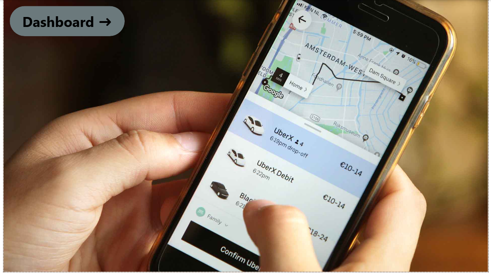
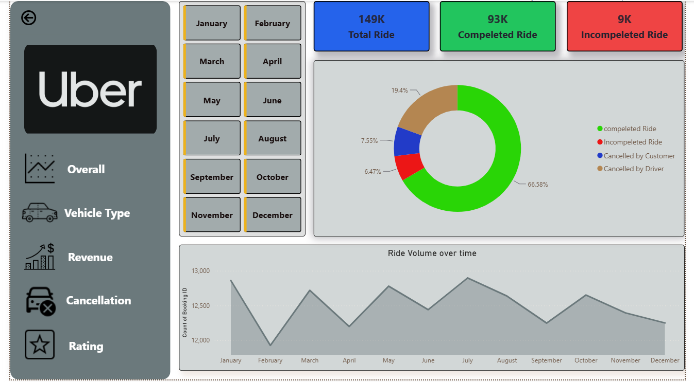
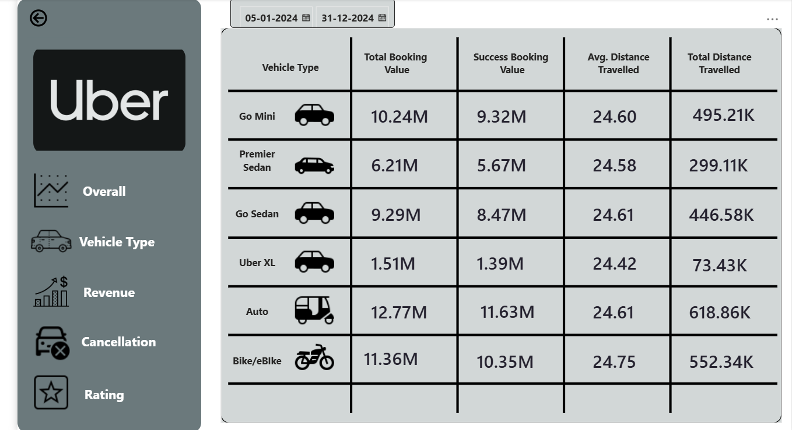
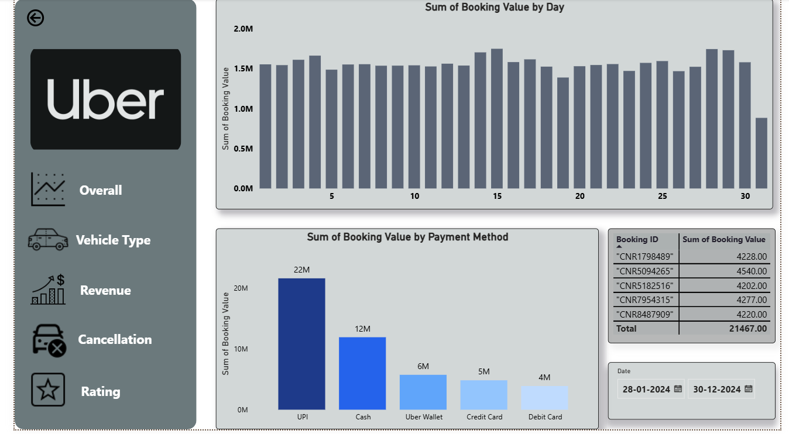
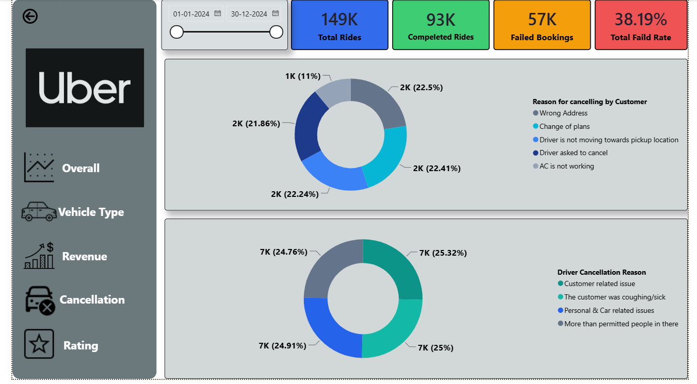
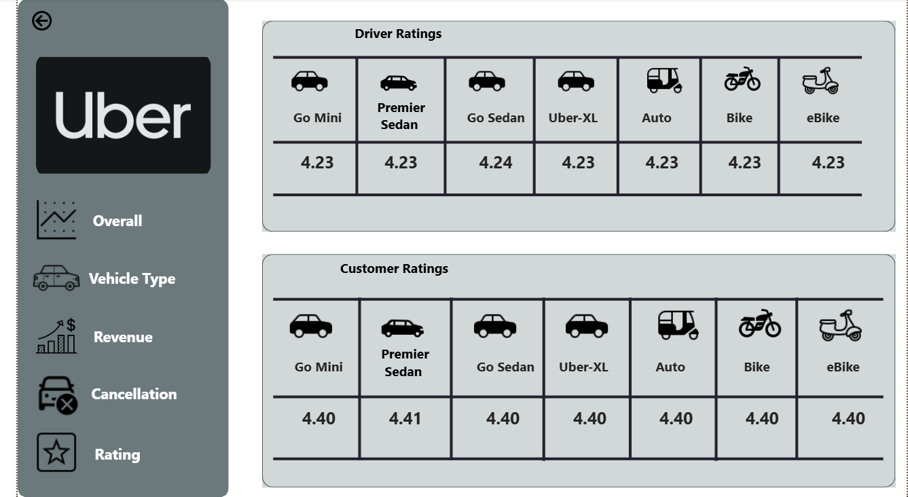

## 📌 Project Overview

This project is an interactive **Power BI dashboard** developed to analyze Uber ride booking data. It provides insights into booking performance, revenue, vehicle performance, cancellation trends, and customer/driver ratings through interactive visualizations.

---

## 🎯 Business Objectives

- Analyze overall booking performance.
- Monitor completed and failed rides.
- Identify major cancellation reasons.
- Compare vehicle-wise performance.
- Analyze revenue and payment methods.
- Evaluate customer and driver ratings.

---

## 📊 Dashboard Pages

### 🏠 Home
This is navigation page for quick access to all dashboard sections.

### 📈 Overview
- Total Bookings
- Completed Bookings
- Failed Bookings
- Failed Booking Rate
- Monthly Booking Trend
- Booking Status Distribution

### 🚗 Vehicle Analysis
- Total Booking Value
- Successful Booking Value
- Average Distance
- Total Distance
- Vehicle-wise Performance Comparison

### 💰 Revenue Analysis
- Revenue by Payment Method
- Revenue Trend
- Payment Method Distribution

### ❌ Cancellation Analysis
- Customer Cancellation Reasons
- Driver Cancellation Reasons
- Failed Booking Analysis

### ⭐ Rating Analysis
- Customer Ratings by Vehicle
- Driver Ratings by Vehicle

---

## 📌 Key Performance Indicators (KPIs)

- Total Bookings
- Completed Bookings
- Failed Bookings
- Failed Booking Rate
- Total Revenue
- Average Booking Value
- Customer Rating
- Driver Rating

---

## 🛠️ Tools & Technologies

- Power BI Desktop
- Power Query
- DAX
- Data Modeling
- Microsoft Excel

---

## 📷 Dashboard Preview

### Home

### Overview

### Vehicle Analysis

### Revenue Analysis

### Cancellation Analysis

### Rating Analysis

---

## 🚀 Key Features

- Interactive Navigation
- Dynamic Slicers
- KPI Cards
- DAX Measures
- Vehicle-wise Analysis
- Revenue Analysis
- Cancellation Insights
- Customer & Driver Rating Analysis

---

## 👨‍💻 Author

**Shubham Uniyal**

Aspiring Data Analyst

### Skills
- SQL
- Excel
- Power BI
- Python (Pandas)

---
